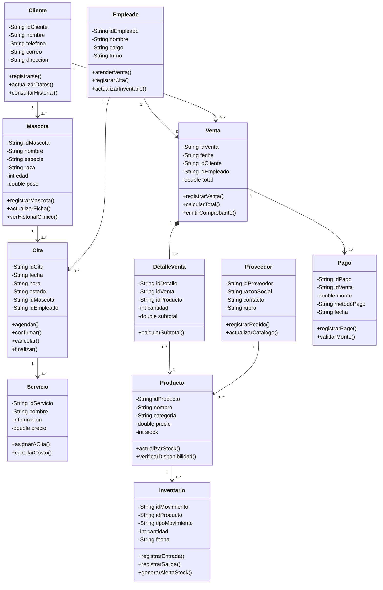
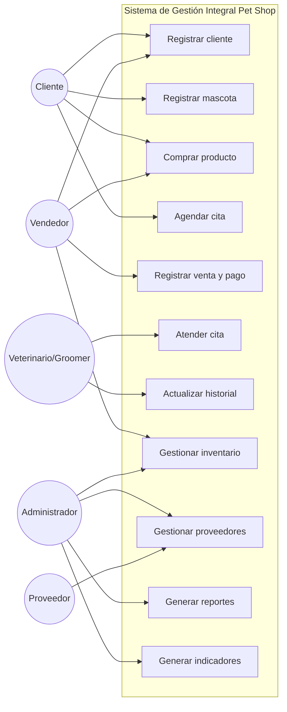
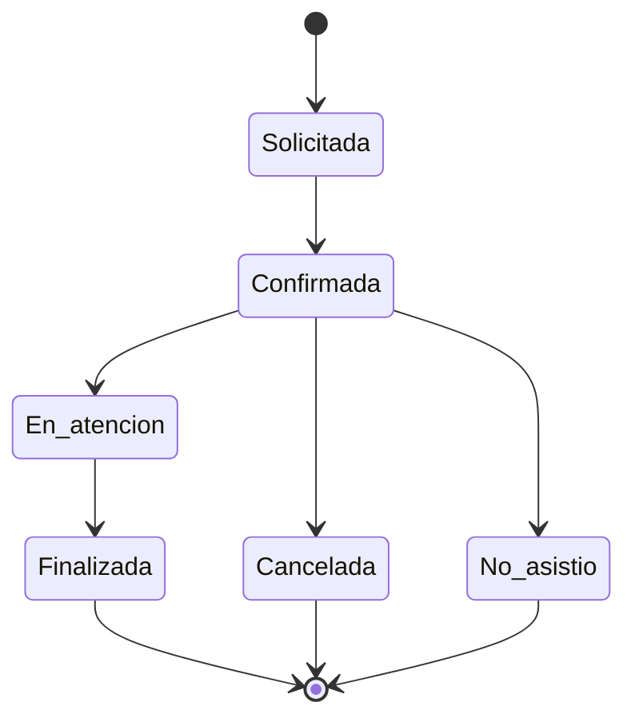
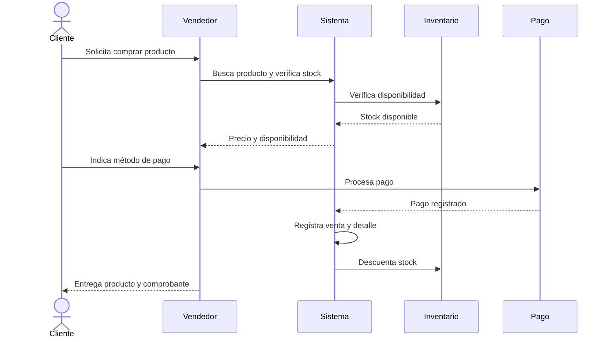

## Diagrama de clases UML completo

## Multiplicidades tomadas del documento

- Cliente → Mascota: **1 a 1..***
- Mascota → Cita: **1 a 1..***
- Empleado → Cita: **1 a 0..***
- Empleado → Venta: **1 a 0..***
- Cita → Servicio: **1 a 1..***
- Cliente → Venta: **1 a 0..***
- Venta → DetalleVenta: **1 a 1..***, composición
- DetalleVenta → Producto: **1..* a 1**
- Venta → Pago: **1 a 1..***
- Proveedor → Producto: **1 a 1..***
- Producto → Inventario: **1 a 1..***

## Diagrama de casos de uso

## Diagrama de estados de Cita

## Diagrama de secuencia de venta

